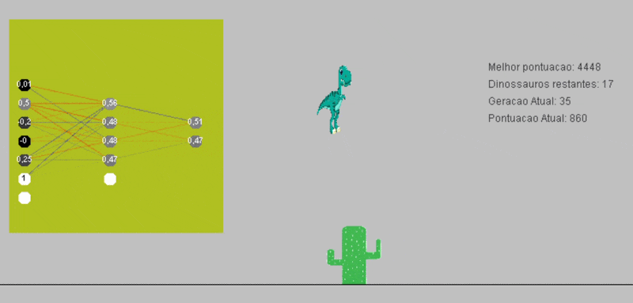

# Dino

<p align="center">
  
</p>

<div align="center">
  
  
  
  
</div>

<p align="center">
  <strong>Um jogo em Java inspirado no dinossauro do Chrome, com dinossauros controlados por uma rede neural que tenta aprender a sobreviver.</strong>
</p>

---

## ✨ Visão geral

Este projeto mistura duas coisas muito legais:

- um jogo de obstáculos com mecânica simples e dinâmica;
- uma rede neural criada do zero em Java para tomar decisões dos dinossauros;
- tudo em um ambiente visual minimalista, divertido e fácil de executar.

O objetivo é observar os dinossauros tentarem evitar obstáculos e melhorar seu desempenho ao longo do tempo, como se estivessem "aprendendo" a jogar.

---

## 🧠 Como funciona

A estrutura do projeto é simples e direta:

1. O jogo gera obstáculos aleatórios;
2. Cada dinossauro recebe informações do ambiente;
3. A rede neural calcula a melhor ação;
4. O dinossauro pula ou continua conforme a decisão;
5. A pontuação cresce conforme ele sobrevive mais tempo.

Esse comportamento cria uma experiência interessante de simulação e aprendizado, com uma proposta muito visual e didática.

---

## 🎮 Destaques

- Jogo em Java puro, sem bibliotecas externas para IA;
- Dinossauros controlados por rede neural;
- Obstáculos em sequência com aumento gradual de desafio;
- Sistema de pontuação e sobrevivência;
- Visual retrô e estilo simples, porém marcante;
- Código organizado em classes Java para facilitar estudo e evolução.

---

## 🚀 Como executar

Você precisa apenas do **JDK 8 ou superior** instalado.

### 1. Clone o projeto

```bash
git clone https://github.com/fernando1000/Dino.git
cd Dino
```

Ou baixe o repositório em ZIP e extraia os arquivos.

### 2. Inicie o jogo

#### Windows

```powershell
.\executar.bat
```

#### macOS e Linux

```bash
sh executar.sh
```

O script compila o código e abre o jogo. Na primeira execução, a compilação pode levar alguns segundos.

> Caso apareça a mensagem `javac not found`, verifique se o JDK está corretamente instalado e adicionado ao `PATH`.

---

## 📁 Estrutura do projeto

```text
Dino/
├── src/                 # Código-fonte Java
├── arquivos/            # Recursos gráficos e sonoros
├── build/               # Arquivos compilados
├── executar.bat         # Script para Windows
├── executar.sh          # Script para macOS/Linux
├── README.md            # Documentação do projeto
├── .gitignore
└── LICENSE              # Se existir no repositório
```

---

## 🧪 Tecnologias envolvidas

- Java
- Programação orientada a objetos
- Lógica de jogos
- Redes neurais artificiais criadas do zero
- Simulação de agentes e tomada de decisão

---

## 💡 Por que este projeto é interessante?

Porque ele junta duas áreas muito legais de estudo:

- desenvolvimento de jogos;
- inteligência artificial aplicada de forma prática.

É uma ótima forma de aprender como uma IA pode tomar decisões em tempo real dentro de um ambiente simples, visual e interativo.

---

## 🚀 Conclusão

Se você gosta de Java, jogos, IA e experimentação prática, esse projeto é uma ótima maneira de explorar esses conceitos em um único lugar.

Basta executar, acompanhar os dinossauros e ver a evolução do comportamento dos agentes ao longo da simulação.
